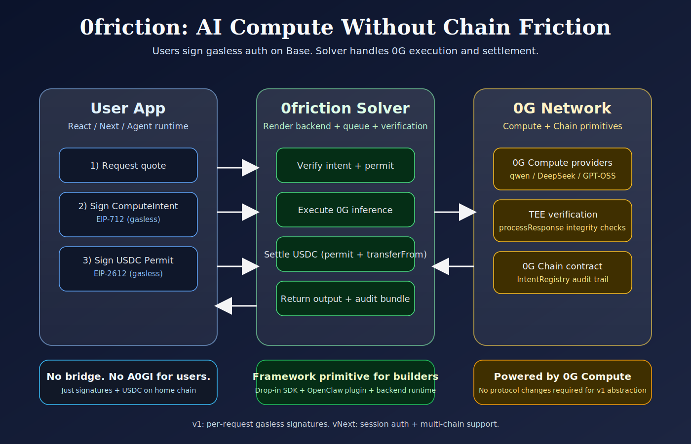

# 0friction

Cross-chain AI compute via 0G. Pay with USDC, no bridge, no 0G token management for end users.

0friction is a framework-level project for the 0G Open Agents track:
- `@0friction/sdk` (TypeScript SDK for any runtime)
- Solver backend (0G execution + USDC settlement)
- Demo frontend and working CLI agent example

## Live Links

- Live backend (Render): `https://zerofriction-solver.onrender.com`
- Live frontend (Vercel): `https://0friction.vercel.app` (update if your final URL differs)
- npm package: `https://www.npmjs.com/package/@0friction/sdk`
- GitHub: `https://github.com/officialcmg/0friction`

## Architecture Diagram



## Why this matters

0G compute is powerful, but user onboarding breaks when apps require bridging and native token flow. 0friction abstracts that away:
- users sign gasless auth on home chain
- solver executes inference on 0G
- solver settles USDC on home chain

This turns 0G compute into a drop-in developer primitive for agents and apps.

## Project Structure

```
0friction/
├── sdk/              @0friction/sdk (published npm package)
├── backend/          Solver backend (Express + 0G compute SDK)
├── frontend/         Next.js demo app
├── examples/         Working example agent (CLI)
├── contracts/        IntentRegistry (deployed on 0G Galileo)
└── architecture-0friction.svg
```

## Deployment and Contracts

- IntentRegistry (0G Galileo / chain 16602):
  - `0x01D1084d915eAb33A36FBaBFC29Dc8e6478b0926`
  - https://chainscan-newton.0g.ai/address/0x01D1084d915eAb33A36FBaBFC29Dc8e6478b0926
- Solver address:
  - `0xB9a33C169d1360E6AdFf7266797f85467856bCc2`
- Home-chain payment token (Base Sepolia USDC):
  - `0x036CbD53842c5426634e7929541eC2318f3dCF7e`

## SDK usage (high level)

```ts
import { createClient } from "@0friction/sdk";

const client = createClient();

const quote = await client.quote.get({
  model: "qwen/qwen-2.5-7b-instruct",
  prompt: "Explain 0G compute in one sentence.",
});

const intent = client.intent.build({
  quote,
  owner: userAddress,
  requestPayload: {
    model: "qwen/qwen-2.5-7b-instruct",
    messages: [{ role: "user", content: "Explain 0G compute in one sentence." }],
  },
  nonce: String(Date.now()),
});

// App layer signs intent + permit using viem/ethers/wagmi
const result = await client.intent.submit({
  intent,
  intentSignature,
  permit,
  permitSignature,
  requestPayload,
  quoteId: quote.quoteId,
});
```

## Gasless flow (v1)

For each request:
1. SDK fetches quote from solver.
2. User signs EIP-712 ComputeIntent (gasless signature).
3. User signs EIP-2612 USDC Permit (gasless signature).
4. Solver verifies, runs compute on 0G, and settles via `permit + transferFrom`.
5. App receives response + audit bundle.

## Working example agent

- CLI agent path: `examples/cli-agent.ts`
- SDK E2E test path: `test-sdk.ts`

## 0G features used

- 0G Compute inference via `@0gfoundation/0g-compute-ts-sdk`
- Service discovery (`listService`)
- TEE response verification (`processResponse`)
- 0G chain deployment (IntentRegistry contract)

## Current scope and roadmap

This is an initial version optimized for hackathon reliability:
- v1: Base Sepolia + USDC + per-request signatures
- Next: multi-chain settlement and smoother session-style auth (no per-message signing UX)
- Next: richer agent modules and deeper OpenClaw integrations

## Quick local run

```bash
npm install
cp .env.example .env
npm run dev --workspace=backend
# in another terminal
cd frontend && npm run dev
```

## Team

- Chris Gachau
- X: `chrismgtweets_`
- Telegram: `chrismgeth`

## License

MIT
